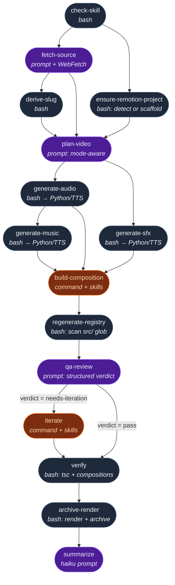

# Building a Remotion Video Workflow in Archon

*A case study for the Archon workshop — how a conversational pair-building session turned into a showcase-ready workflow.*

**One of three example workflows presented tonight.** The other two cover different workflow shapes; this one is the "creative-output, multi-modal, bring-your-own-URL" pattern.

---

## What we built

A single Archon workflow, `remotion-from-hn`, that takes a URL and produces a polished ~40-second Remotion video from it — voiced, with sound effects, optionally with music, rendered to mp4, and archived in-repo alongside every past run.

Three live examples now live in the repo under `./videos/`:

| Source | Mode | Length | Features |
|---|---|---|---|
| Today's HN top story | `hn` (auto-pick) | 57.6s | Voice + SFX |
| https://archon.diy | `marketing` (pitch) | 41.3s | Voice + SFX + visual-diagrams scene |
| https://sasharec.ai/ | `marketing` (pitch) | 36.8s | Voice + SFX + full animation-quality rules |

The whole thing is one YAML file, three Python scripts, two command files, and one brand example — plus the `remotion-best-practices` skill to drive video quality. About 1400 lines of workflow infrastructure total.

---

## What the workflow looks like

Fifteen nodes, four parallel tracks where it matters, one conditional gate. **The shape is the story** — every branch exists because a specific failure mode needed isolating.



**Node-type legend**:
- 🟦 **bash** — shell script, no AI. Cheap, deterministic. Used for parsing, filesystem work, and invoking local Python.
- 🟪 **prompt** — inline AI prompt. Good for judgment calls, parsing messy input, or calling WebFetch against arbitrary sites.
- 🟧 **command** — heavy AI work driven by a `.md` file in `.archon/commands/`. Loads skills, writes code, runs its own tsc loop.

**Parallel tracks**:
- `check-skill` splits into `fetch-source` **and** `ensure-remotion-project` — the Remotion project can be bootstrapping while we're WebFetching the source URL.
- After `plan-video`, `generate-audio` and `generate-sfx` run in parallel. `generate-music` waits for audio so it can size the BGM to the voiceover length.
- `build-composition` joins all three audio tracks before it starts (`trigger_rule: all_success`).

**The conditional gate**:
- `qa-review` emits a structured `{verdict}` field. `iterate` only runs when `verdict == "needs-iteration"` (Archon's `when:` expression evaluates off the prior node's structured output).
- `verify` depends on both `qa-review` AND `iterate` with `trigger_rule: none_failed_min_one_success` — so it runs whether iterate fired or was skipped, but fails fast if iterate itself failed.

**Opt-in layers that can no-op**:
- `generate-music` and `generate-sfx` exit 0 silently when their provider env vars aren't set. `build-composition` then detects their manifest files are absent and builds a version of the composition that doesn't reference them. The DAG shape stays the same; the output adapts.

---

## The overall arc

We did **five iterations + one polish pass** over one session. Each iteration was triggered by a real moment of friction — a feature missing, a bug surfacing, or a quality ceiling we hit.

| Version | Trigger | What changed |
|---|---|---|
| v1 | *"Build a workflow that makes a video from today's top HN story"* | 8-node DAG: HN fetch → scaffold → plan → build → QA → iterate → verify → summary. Silent video. |
| v2 | *"Add voice, music, SFX — but only if the user has a key"* | Opt-in ElevenLabs audio layers. Cartesia for voice. Brand config. Diagram-aware planning. Auto-render + archive. |
| v3 | *"All the videos should be in one place. The workflow should scaffold the Remotion project itself."* | Repo becomes the library. `ensure-remotion-project` auto-detects or scaffolds. Compositions accumulate in `src/<Slug>/`. |
| v4 | *"I want to pass any URL, and a marketing mode for product pitches"* | Replaced curl-based HN fetch with a WebFetch prompt node. `hn`/`article`/`marketing` modes. Mode-aware plan + QA. |
| v5 | *(Two bugs surfaced mid-run)* | Scaffold clobber of `.git/` fixed; `import.meta.glob` replaced with a generated static registry. |
| Polish | *"Video works but quality is so-so"* | 10-item animation-quality pass pulling patterns from the `remotion-best-practices` skill directly into the prompts. |

---

## How we worked (the conversation pattern)

This wasn't a "write a spec, hand it off, come back later" session. It was closer to pair programming at conversational pace. A typical turn looked like:

- **Rasmus opens with intent, not requirements.** Messages like *"let me know what it does"*, *"I want to test that later so don't scaffold manually"*, *"the video works but quality is so-so"*, *"Run on archon.diy"*. Rarely was there a spec up front — the spec emerged turn by turn.
- **I (Claude) propose a concrete design before writing code.** Brainstorm first, tight scope list, flag open decisions, ask for sign-off. Turns like *"Before I write, here's the compact v4 plan — want to confirm the shape?"* — that saved us from writing things twice.
- **Rasmus pushes back by adding constraints, not rewriting.** Example: *"Don't scaffold the Remotion project manually — I want the workflow to do it so I can test that path later."* That single sentence killed what would have been a 30-minute detour into a committed scaffold.
- **Failures become the interesting part.** Most of our best work happened *after* something broke. The `.git/` clobber, the silent-voice run, the ElevenLabs paywall, the `import.meta.glob` runtime error — each one taught us a fixable-but-non-obvious lesson that went straight into the workflow as a durable rule.

The key move that kept things moving: every time I was about to do something risky (delete files, push to main, start a scaffold), I listed the exact effect and asked before pulling the trigger. Two confirmations later the risk is negligible; silent destruction is infuriating.

---

## Issues we hit — and what they taught us

The interesting workshop material isn't the happy path. It's the friction. Here are the six most instructive moments.

### 1. The ElevenLabs voice paywall

**What happened**: First ElevenLabs voice run hit a 402. My default voice ID was *Rachel* — a community "library" voice that requires a paid plan. Free-tier users can only use voices attached to their account by default.

**Fix**: Queried the user's own ElevenLabs account via `/v2/voices`, picked **Bella** (`hpp4J3VqNfWAUOO0d1Us`) — a "premade" voice that ships with every account, labeled *Professional, Bright, Warm*. Swapped default, rerun passed.

**Takeaway**: When building a workflow that other people will run with their own keys, test against the *free tier* early. Defaults matter. A workflow that requires a paid plan "by default" isn't a showcase — it's a paywall.

### 2. The silent video that wasn't

**What happened**: I ran the workflow, watched the receipt say *verdict: pass*, opened Studio — no audio. Confusing because voice had worked moments before.

**Root cause**: I'd manually `rm -rf`'d an earlier run's artifacts dir to force a fresh run. But Archon's workflow DB still had the nodes marked as prior-success. The next run resumed from that DB state, skipped `generate-audio` (which was "completed" per the DB), and the build node saw no voice manifest, so it produced a silent composition. Everything was *internally consistent*, just wrong.

**Fix**: Deleted the broken row from `archon.db` to force a truly fresh run. Workflow's core was fine — this was my operational error.

**Takeaway**: Archon's resume-on-failure is great. But "resume" and "fresh run" are different operations, and it's worth knowing exactly which one you're triggering. The fact that the workflow still produced a clean pass (it just produced a *silent* pass) was actually the feature working: no voice manifest → silent mode → valid output. Fail-safe, not fail-loud.

### 3. The `.git/` clobber

**What happened**: Mid-run the scaffold step ran `cp -R "$TMP/_project/." .` to drop the `create-video` template into the repo root. That included the scaffold's own `.git/` directory (create-video runs `git init`). cp silently overwrote our repo's `.git/`. Local history disappeared. Origin was safe (I'd pushed), but the local checkout looked like a fresh one-commit repo.

**Fix in code**: added `rm -rf "$TMP/_project/.git" "$TMP/_project/.gitignore" "$TMP/_project/README.md"` before the copy, so the scaffold never touches host-curated files.

**Fix locally**: `git init`, `remote add`, `fetch`, set HEAD to `feat/remotion-from-hn-v2` — working tree preserved.

**Takeaway**: When merging a generated tree into a user's repo, never `cp -R .` blindly. Enumerate the files you want to preserve explicitly. And always push your branch *before* a destructive operation — origin is your undo button.

### 4. `import.meta.glob` meets Webpack

**What happened**: In v3 I introduced an "auto-registering" `Root.tsx` using Vite's `import.meta.glob` to pick up every composition in `src/*/index.ts`. tsc complained (wrong `module` + `lib` settings), but more importantly, at runtime Studio threw `{}.glob is not a function`. Remotion bundles with **Webpack**, which doesn't transform `import.meta.glob` — the expression ships verbatim to the browser.

**Fix**: Replaced the magic glob with a **generated static registry**. New bash node `regenerate-registry` runs after `build-composition`, scans `src/<Slug>/index.ts` files, writes `src/compositions.gen.ts` with explicit imports. `Root.tsx` imports the registry — plain JS, Webpack-happy, tsc-clean.

**Takeaway**: "Clever" imports are a lot cleverer when you control the bundler. If you don't, a generated file you can `cat` is usually a better primitive than a build-time macro.

### 5. The animation-quality ceiling

**What happened**: After v5 everything ran, videos rendered, verdicts said pass. But Rasmus said: *"the video works but quality is so-so, but fix the bugs."* Classic state — **the workflow is functionally correct but the output is generic.** QA kept flagging the same issues across runs: missing transitions, no-op interpolations, vague entrance motion.

**How we diagnosed it**: I read through the `remotion-best-practices` skill's rule files (`timing.md`, `animations.md`, `text-animations.md`, `transitions.md`, `fonts.md`) and cross-referenced what the skill mandates vs what our prompts actually required of the builder. The skill had strong opinions our prompts hadn't surfaced.

**Fix**: A 10-item prompt upgrade across three files:
- `plan-video` got a controlled animation vocabulary (typewriter, fade-up, stagger-in, counter-pop, word-highlight, ken-burns, diagram-reveal) and a demoted `hard-cut` that's no longer the default transition.
- `build-composition` got explicit requirements for `<TransitionSeries>` + `@remotion/transitions`, a Bézier easing palette, the composed-progress pattern, `premountFor` on every Sequence, seconds × fps durations, `@remotion/google-fonts` with declared weights and subsets, and string-sliced typewriters.
- `qa-review` got new HIGH/MED/LOW severity checks aligned to those rules so regressions get caught.

Next run on sasharec.ai produced transitions via `@remotion/transitions`, named Bézier easing on every `interpolate()`, premount on every Sequence — every new rule held on the first try.

**Takeaway**: **Skills are more useful as prompt inputs than as runtime dependencies.** We'd been loading the skill into the builder's context and hoping. Explicitly pulling the skill's conventions into our prompts, and adding QA checks that enforce them, turned "best practices" from decoration into contract.

### 6. Archon's auto-resume gotcha

**What happened**: Twice I restarted a workflow and was surprised to see early nodes "Skipped (prior_success)" — even when my expectation was a fresh run. This happened when a previous run had been marked `completed` in archon's DB but I'd deleted artifacts on disk. Subsequent runs happily skipped the "completed" nodes but couldn't find the files downstream.

**How we handled it**: Once the pattern was clear, the fix was mechanical: either re-push the artifacts the node would have produced, delete the DB row, or use a distinct workflow run ID.

**Takeaway**: Archon caches by `workflow_run_id` + `node_id`. If you edit artifacts directly, the cache becomes a liar. For fresh runs, prefer starting clean (fresh UUID) over manipulating artifact directories.

---

## Where the Archon skill pulled its weight

Specific features we used, in roughly the order they mattered:

- **`nodes` DAG structure** — the whole workflow is a graph, not a script. Parallel audio generation (`generate-audio`, `generate-sfx`, `generate-music`) all hang off `plan-video` and run concurrently. `build-composition` waits on all three via `trigger_rule: all_success`. That's one YAML field doing what would be dozens of lines of shell-glue.
- **Mixed node types** — bash (`fetch-source` originally, `derive-slug`, `regenerate-registry`, `archive-render`), prompt (`fetch-source` in v4, `plan-video`, `qa-review`, `summarize`), and command (`build-composition`, `iterate`). Each type is right for its job. We didn't try to make everything AI-driven.
- **`skills:` field** — `remotion-best-practices` + `visual-diagrams` both attached to `build-composition` and `iterate`. The builder gets domain knowledge without us copying it into the prompt.
- **`output_format` with structured JSON** — `fetch-source` emits `{mode, title, url, source_type}`. `qa-review` emits `{verdict, modes, counts, summary}`. Downstream nodes pick fields out via `$nodeId.output.field`. Prevents brittle string parsing.
- **`when:` conditions** — `iterate` only fires when `$qa-review.output.verdict == 'needs-iteration'`. Zero wasted API calls on pass runs.
- **`trigger_rule: none_failed_min_one_success`** — `verify` runs whether `iterate` executed or was skipped. Critical for the conditional-iterate pattern to not deadlock.
- **`context: fresh`** — every AI-driven node starts with a clean context. Prevents the builder from inheriting planner ambiguity, and lets us feed each agent exactly the files it needs via `$ARTIFACTS_DIR`.
- **`archon validate workflows` / `archon validate commands`** — caught YAML schema issues and unresolved `$node.output` references before we ever spent money on a real run. Used this after every edit.

The meta-skill was **the `archon` skill itself** — that's what told me to treat these as a toolkit rather than figuring out workflow authoring from first principles.

---

## Process, in one breath

> Start with the smallest workflow that produces a real artifact. Run it. Let the failures drive the next feature. Write the rules into prompts, not into conversation history. Keep each node small. Use structured output. Gate expensive nodes behind cheap ones. Push early, push often — origin is your safety net. When quality feels "so-so", read the skill you already loaded and steal its opinions.

---

## What an attendee could take home

1. **Design for opt-in.** Voice is `auto-detect`. Music is `MUSIC_PROVIDER=elevenlabs` — explicit. Any layer that costs money or requires a paid tier should require a deliberate flag, not a happy accident.
2. **Fail loud, never silent.** Every API error in our scripts exits non-zero with the HTTP body in the message. `archive-render` halts if render fails; the archive isn't written. The one time something "ran silently wrong" (the silent-video bug) was my operational mistake, not the workflow's.
3. **Make artifacts browsable.** The final receipt says `Archive: ./videos/<date>-<slug>/`. Every plan, narration, QA finding, and mp3 manifest lands in that folder alongside the mp4. When something looks off post-run, the evidence is on disk, not in a UUID'd workspace 4 directories deep.
4. **Separate timing from mapping.** This came from the Remotion skill but applies broadly to DAG design. One node computes "how long" (`fetch-source` → duration); downstream nodes compute "how to display". Don't braid them.
5. **Treat prompts as contracts, not vibes.** Before our animation-quality pass, prompts had vibes: *"dynamic entrance motion"*, *"use best practices"*. After, they have named rules: *`premountFor={fps}` on every Sequence*, *`Easing.bezier(0.16, 1, 0.3, 1)` for enter motions*. Rules survive model regressions. Vibes don't.
6. **Persistence via repo, ephemera via `$ARTIFACTS_DIR`.** We use Archon's artifacts dir for *this run's* state (plan, narration, findings). We use the repo for *the library* (accumulated compositions, committed audio assets if desired). That boundary makes the "iterate on an old video" workflow we sketched for v6 trivial to add.
7. **Write the workflow you'd want to run on a fresh clone.** The final PR removed every workflow-output file from the working tree before merge. Someone cloning the repo and running `archon workflow run remotion-from-hn --no-worktree "marketing https://their-site.com"` will bootstrap the whole Remotion project + produce a video with no manual setup. That is the showcase.

---

## Files produced in this session

```
.archon/
├── workflows/
│   └── remotion-from-hn.yaml           # 15-node DAG, 3 modes, opt-in audio
├── commands/
│   ├── remotion-build-composition.md   # builder contract + animation rules
│   └── remotion-iterate.md             # fixer contract (scoped)
├── scripts/
│   ├── _audio_common.py                # env loader + brand yaml reader
│   ├── generate_voiceover.py           # Cartesia or ElevenLabs TTS
│   ├── generate_music.py               # ElevenLabs music (opt-in)
│   └── generate_sfx.py                 # ElevenLabs SFX (opt-in)
├── brand.example.yaml                  # optional palette/font/watermark/tone
└── .env                                # API keys (gitignored)
```

Plus three skills installed via `npx skills add remotion-dev/skills`:
- `remotion-best-practices` (animation + voiceover rules)
- `visual-diagrams` (hub-and-spoke / flow / comparison components)
- `archon` (authoring docs for the next workflow someone builds)

---

*Total session output: one draft PR with 3 commits on top of the earlier merged v2 PR, ~1400 lines of workflow infrastructure, and 3 live marketing/explainer videos sitting in the repo.*
